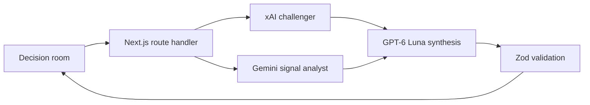

# SDP Decision Room

SDP is a multi-model Scenario Development Process for decisions that must remain sound under uncertainty. The 2.0 foundation replaces the previous AWS-first demo with a Vercel-native Next.js application, a purpose-built decision-room interface, typed model outputs, and an explicit evidence and dissent model.

## What works now

- A decision brief captures the organization, focal question, horizon, constraints, and known uncertainties.
- xAI 4.1 challenges hidden assumptions and identifies discontinuities.
- Gemini 3.5 Flash maps signals, causal drivers, and evidence gaps.
- GPT-6 Luna synthesizes four typed alternative futures, signposts, strategic moves, no-regret actions, and model dissent.
- Every result shows provider, model, role, and execution time.
- Generated briefs are saved locally in the browser and appear in the library and portfolio views.
- The UI is responsive, keyboard accessible, and respects reduced-motion preferences.
- GitHub Actions runs lint, TypeScript, unit tests, and a production build before deployment.
- A verified Vercel preview is promoted to production only after its runtime health check passes.

## Architecture



The active product lives in `frontend/web-app`. Python and AWS artifacts under `backend/` are legacy reference code and are not part of the Vercel runtime.

## Local verification

Provider keys are not stored in `.env` files. The UI, schemas, and failure paths can be verified without credentials:

```bash
cd frontend/web-app
npm ci
npm run lint
npm run typecheck
npm run test
npm run build
npm run dev
```

Without injected credentials, `GET /api/health` intentionally returns `503 configuration_required` and the interface explains that provider configuration is required.

## GitHub Actions secrets

The three existing provider secret names are:

- `XAI_API`
- `GEMINI_API`
- `OPENAI_API`

The Vercel workflow also requires:

- `VERCEL_TOKEN`
- `VERCEL_ORG_ID`
- `VERCEL_PROJECT_ID`

The workflow passes provider secrets directly to the deployment with Vercel CLI runtime flags. It does not create or populate an environment file. Pull requests run verification without provider secrets and cannot invoke paid models.

## Deploy

1. Create a Vercel project whose root is `frontend/web-app`.
2. Add the three Vercel connection values above as GitHub Actions secrets.
3. Keep the provider values in the existing GitHub Actions secrets.
4. Run the `Deploy Vercel` workflow or push to the `main` branch.
5. The workflow builds an immutable preview, checks `/api/health`, and promotes that exact artifact.

## Security release gate

An older Google-style credential was committed in the legacy Python source and documentation. It has been removed from the current tree, but Git history is immutable. Revoke and rotate that key before any deployment, then consider history rewriting with coordinated force-push only after every clone and integration is accounted for.

No provider key is exposed through a `NEXT_PUBLIC_` variable or returned by the health endpoint.

## Current boundaries

This is the production foundation, not the end of the overhaul:

- Results are browser-local; shared persistence, teams, and authorization are not connected yet.
- Model outputs are not live research. The product labels evidence gaps and does not fabricate citations; source ingestion and retrieval are the next backend milestone.
- Authentication, durable rate limiting, metering, and audit events must ship before opening model generation to untrusted users.
- Legacy AWS infrastructure is no longer deployed, but the remaining legacy backend code still needs archival or removal after output-parity validation.

See [docs/MIGRATION_STATUS.md](docs/MIGRATION_STATUS.md) for the release plan and [SECURITY.md](SECURITY.md) for vulnerability reporting and credential rules.
