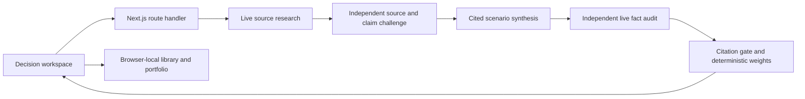

# SDP Decision Room

SDP is a Scenario Development Process for decisions that must remain sound under uncertainty. The current product replaces the previous AWS-first demo with a Vercel-native Next.js application, an accessible decision workspace, structured scenario outputs, and explicit evidence and dissent handling.

## What works now

- A public welcome page leads into a focused scenario workspace; no account is required.
- A decision brief captures the organization, industry, geography, focal question, horizon, constraints, and known uncertainties.
- Company search combines more than 62,000 deduplicated public-company entries, a private-company catalog, and live global exchange lookup while accepting any custom organization name. Cross-listings are grouped under one issuer; the directory is not treated as research evidence. The global directory is attributed to [FinanceDatabase](https://github.com/JerBouma/FinanceDatabase), with its pinned revision and MIT licence retained in `src/data`.
- Structured outputs include alternative futures, signposts, strategic moves, no-regret actions, evidence gaps, and dissent.
- Generated analyses have permanent local addresses and separate Analysis/PDF views. IndexedDB backs up their structured data and documents; removal moves both to recoverable Trash. Permanent deletion, signal deletion and initiative removal require confirmation. Existing PDFs can be imported into the library.
- PDF reports use measured A4 pagination, monochrome typography, white table headers, repeated letterheads, numbered tables/figures, an evidence ledger and a numbered bibliography. Mermaid flow, strategic-field and weight/sensitivity charts are embedded in the document.
- A custom in-product document studio reviews local PDF and `.pptx` evidence without uploading it.
- The OLED interface uses React Aria Components, keyboard-accessible controls, responsive navigation, reduced-motion support, and long-duration blue/moss ambient themes.
- GitHub Actions runs lint, TypeScript, unit tests, and a production build before deployment.
- A verified Vercel preview is promoted to production only after its runtime health check passes.

## Architecture



The active product lives in `frontend/web-app`. Python and AWS artifacts under `backend/` are legacy reference code and are not part of the Vercel runtime.

## Local verification

Provider keys are not stored in `.env` files. The UI, schemas, and failure paths can be verified without credentials:

```bash
cd frontend/web-app
npm ci
npm run lint
npm run typecheck
npm run test
npm run build
npm run dev
```

Without injected credentials, `GET /api/health` intentionally returns `503 configuration_required`. The product surface does not expose provider or model names.

## GitHub Actions secrets

The three existing provider secret names are:

- `XAI_API`
- `GEMINI_API`
- `OPENAI_API`

The Vercel workflow also requires:

- `VERCEL_TOKEN`
- `VERCEL_ORG_ID`
- `VERCEL_PROJECT_ID`

The workflow passes provider secrets directly to the deployment with Vercel CLI runtime flags. It does not create or populate an environment file. Pull requests run verification without provider secrets and cannot invoke paid models.

## Deploy

1. Create a Vercel project whose root is `frontend/web-app`.
2. Add the three Vercel connection values above as GitHub Actions secrets.
3. Keep the provider values in the existing GitHub Actions secrets.
4. Run the `Deploy Vercel` workflow or push to the `main` branch.
5. The workflow builds an immutable preview, checks `/api/health`, and promotes that exact artifact.

## Security release gate

An older Google-style credential was committed in the legacy Python source and documentation. It has been removed from the current tree, but Git history is immutable. Revoke and rotate that key before any deployment, then consider history rewriting with coordinated force-push only after every clone and integration is accounted for.

No provider key is exposed through a `NEXT_PUBLIC_` variable or returned by the health endpoint.

## Product boundaries

- Results, portfolio items, and signals are intentionally browser-local for this single-user academic deployment; there are no accounts, teams, or version history.
- Shared report links encode a read-only snapshot in the URL and do not provide collaborative editing.
- The document studio renders PDFs and PowerPoint masters, layouts, formatted text, images, tables, charts, shapes, and SmartArt locally. PowerPoint animations, video, audio, and 3D effects are not supported.
- Every new generation requires provider-native web research, accessible references, independent claim review and a final fact audit. Reports failing evidence coverage or audit are withheld. Earlier saved reports remain explicitly unverified; citations are not invented for them.
- Conditional weights are calculated reproducibly from common accepted evidence factors and explicit likelihood judgments. Sensitivity ranges are not statistical confidence intervals or guarantees of future outcomes. Model judgments and separate research runs can differ.
- Browser-local data has no expiry, but clearing browser data or changing browser/device removes access. Download important documents as backups. The app does not promise cloud storage or recovery of already-deleted historical analysis.

The manual `Verify live evidence pipeline` action exercises all paid stages against production and exports the resulting PDF. It runs only when explicitly dispatched, not on every push.
- Legacy AWS infrastructure is no longer deployed, but the remaining legacy backend code is retained as reference until output-parity review is complete.

See [docs/MIGRATION_STATUS.md](docs/MIGRATION_STATUS.md) for the release plan and [SECURITY.md](SECURITY.md) for vulnerability reporting and credential rules.
